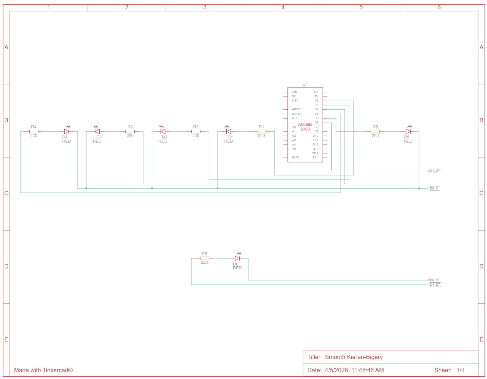

# 📘 Praktikum Sistem Tertanam - Modul 1 Perulangan

# Pertanyaan Praktikum

1. Gambarkan rangkaian schematic 5 LED running yang digunakan pada percobaan!
2. Jelaskan bagaimana program membuat efek LED berjalan dari kiri ke kanan!
3. Jelaskan bagaimana program membuat LED kembali dari kanan ke kiri!
4. Buatkan program agar LED menyala tiga LED kanan dan tiga LED kiri secara bergantian
dan berikan penjelasan disetiap baris kode nya dalam bentuk README.md!

---

# Jawaban

## 1. Gambar rangkaian schematic


---

## 2. Cara Program Membuat Efek LED Berjalan dari Kiri ke Kanan

Efek LED berjalan dari kiri ke kanan dibuat menggunakan **perulangan `for`** yang mengakses pin Arduino secara berurutan dari kecil ke besar.

### Kode Program (Kiri → Kanan)

```cpp
void loop() {
  // looping dari pin rendah ke tinggi (kiri ke kanan)
  for (int ledPin = 2; ledPin < 8; ledPin++) {
    digitalWrite(ledPin, HIGH); // nyalakan LED
    delay(100);                 // tunggu sebentar
    digitalWrite(ledPin, LOW);  // matikan LED
  }
}
```

### Penjelasan Kode

### 1. Perulangan for

```cpp
for (int ledPin = 2; ledPin < 8; ledPin++)
```

* `ledPin = 2` → mulai dari LED paling kiri
* `ledPin < 8` → berhenti di pin 7
* `ledPin++` → pindah ke kanan (naik satu per satu)

Artinya: LED menyala berurutan dari **pin 2 → 3 → 4 → 5 → 6 → 7**

### 2. Menyalakan LED

```cpp
digitalWrite(ledPin, HIGH);
```

* Memberi logika **HIGH**
* LED akan **menyala**

### 3. Delay (Jeda)

```cpp
delay(100);
```

* Memberi jeda 100 ms
* Supaya efek berjalan bisa terlihat

### 4. Mematikan LED

```cpp
digitalWrite(ledPin, LOW);
```

* Memberi logika **LOW**
* LED dimatikan sebelum pindah ke LED berikutnya

### Cara Kerja Efek Running LED

Program bekerja secara berurutan:

1. LED pin 2 menyala → mati
2. LED pin 3 menyala → mati
3. LED pin 4 menyala → mati
4. dan seterusnya sampai pin 7

Karena proses ini cepat dan berulang, terlihat seperti **LED bergerak dari kiri ke kanan**.

### Ilustrasi

```
[2] → [3] → [4] → [5] → [6] → [7]
⬤     ○     ○     ○     ○     ○
○     ⬤     ○     ○     ○     ○
○     ○     ⬤     ○     ○     ○
```

## Kesimpulan

Efek LED berjalan dari kiri ke kanan dibuat dengan:

* Perulangan `for`
* Urutan pin dari kecil ke besar
* Kombinasi `HIGH`, `delay`, dan `LOW`

---

## 3. Cara Program Membuat LED Berjalan dari Kanan ke Kiri

Efek LED dari kanan ke kiri dibuat dengan **perulangan `for` terbalik**, yaitu dari pin terbesar ke pin terkecil.

### Kode Program (Kanan → Kiri)

```cpp id="z4b2ks"
void loop() {
  // looping dari pin tinggi ke rendah (kanan ke kiri)
  for (int ledPin = 7; ledPin >= 2; ledPin--) {
    digitalWrite(ledPin, HIGH); // nyalakan LED
    delay(100);                 // tunggu sebentar
    digitalWrite(ledPin, LOW);  // matikan LED
  }
}
```

## Penjelasan Kode

### 1. Perulangan for (Terbalik)

```cpp id="y6a8qp"
for (int ledPin = 7; ledPin >= 2; ledPin--)
```

* `ledPin = 7` → mulai dari LED paling kanan
* `ledPin >= 2` → berhenti di pin 2
* `ledPin--` → bergerak ke kiri (mundur)

Artinya: LED menyala berurutan dari **pin 7 → 6 → 5 → 4 → 3 → 2**

### 2. Menyalakan LED

```cpp id="g1v9sd"
digitalWrite(ledPin, HIGH);
```

* Memberi logika **HIGH**
* LED akan **menyala**

### 3. Delay (Jeda)

```cpp id="m8t2lk"
delay(100);
```

* Memberi jeda 100 ms
* Supaya perpindahan LED terlihat jelas

### 4. Mematikan LED

```cpp id="q3k7wv"
digitalWrite(ledPin, LOW);
```

* Memberi logika **LOW**
* LED dimatikan sebelum pindah ke LED berikutnya

### Cara Kerja Efek

Program berjalan seperti ini:

1. LED pin 7 menyala → mati
2. LED pin 6 menyala → mati
3. LED pin 5 menyala → mati
4. dan seterusnya sampai pin 2

Karena urutannya dari besar ke kecil, maka terlihat seperti **LED bergerak dari kanan ke kiri**.

### Ilustrasi

```id="n2x8bz"
[7] ← [6] ← [5] ← [4] ← [3] ← [2]
⬤     ○     ○     ○     ○     ○
○     ⬤     ○     ○     ○     ○
○     ○     ⬤     ○     ○     ○
```

### Kesimpulan

Efek LED dari kanan ke kiri dibuat dengan:

* Perulangan `for` terbalik (`--`)
* Urutan pin dari besar ke kecil
* Kombinasi `HIGH`, `delay`, dan `LOW`

---

