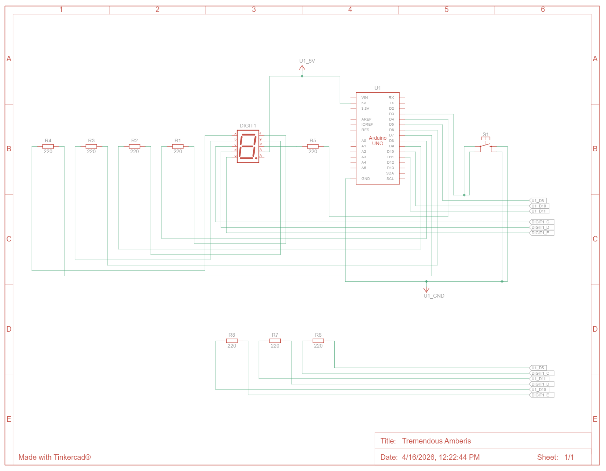

# 📘 Praktikum Sistem Tertanam - Modul 2 Pemrograman GPIO

# Pertanyaan Praktikum
1. Gambarkan rangkaian schematic yang digunakan pada percobaan!
2. Mengapa pada push button digunakan mode INPUT_PULLUP pada Arduino Uno? Apa keuntungannya dibandingkan rangkaian biasa?
3. Jika salah satu LED segmen tidak menyala, apa saja kemungkinan penyebabnya dari sisi hardware maupun software?
4. Modifikasi rangkaian dan program dengan dua push button yang berfungsi sebagai penambahan (increment) dan pengurangan (decrement) pada sistem counter dan berikan penjelasan disetiap baris kode nya dalam bentuk README.md!

----

# Jawaban

## 1. Gambar rangkaian schematic

