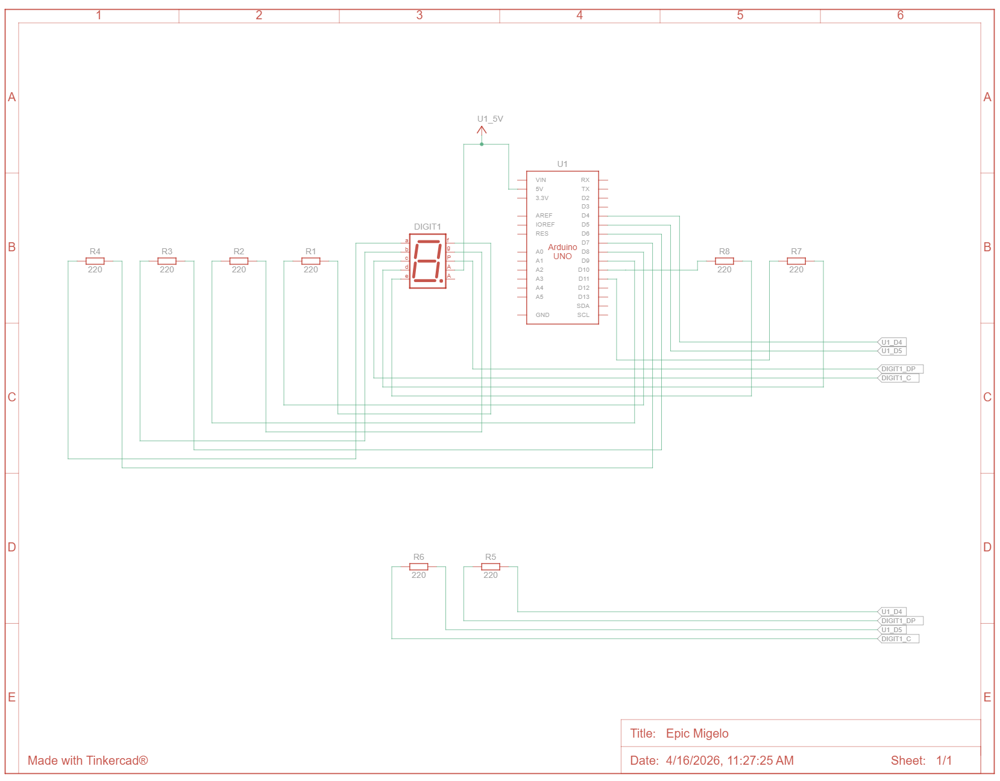

# 📘 Praktikum Sistem Tertanam - Modul 1 Percabangan

# Pertanyaan Praktikum
1. Gambarkan rangkaian schematic yang digunakan pada percobaan!
2. Apa yang terjadi jika nilai num lebih dari 15?
3. Apakah program ini menggunakan common cathode atau common anode? Jelaskan alasanya!
4. Modifikasi program agar tampilan berjalan dari F ke 0 dan berikan penjelasan disetiap baris kode nya dalam bentuk README.md!

---

## Jawaban

## 1. Gambar rangkaian schematic


---

## 2. Apa yang terjadi jika nilai num lebih dari 15?

Nilai `num` pada program merepresentasikan angka heksadesimal dari 0 sampai 15 (0–F). Jika nilai `num` lebih dari 15, maka program tidak memiliki pola tampilan yang sesuai pada seven segment.

Penjelasan:
- Seven segment hanya memiliki 16 pola (0–9 dan A–F)
- Jika nilai melebihi 15, maka:
  - Tampilan bisa tidak sesuai (acak)
  - Atau kembali ke awal (jika menggunakan modulo/loop)

Kesimpulan: nilai harus dibatasi antara 0–15 agar tampilan valid.

---

## 3. Apakah program ini menggunakan common cathode atau common anode? Jelaskan alasannya!

Program ini menggunakan **common cathode**.

Penjelasan:
- Pada common cathode:
  - Semua kaki cathode terhubung ke ground
  - LED menyala jika diberi logika HIGH
- Program menggunakan `digitalWrite(HIGH)` untuk menyalakan segmen
- Hal ini sesuai dengan karakteristik common cathode

Kesimpulan: karena logika HIGH menyalakan LED, maka jenis yang digunakan adalah common cathode.

---

## 4. Modifikasi program agar tampilan berjalan dari F ke 0 dan berikan penjelasan setiap baris kode!

### Modifikasi Program (F ke 0)

```cpp
int num = 15;

void loop() {
  tampilkanAngka(num);  // menampilkan angka ke seven segment
  delay(1000);          // delay 1 detik

  num--;                // decrement nilai

  if (num < 0) {
    num = 15;           // reset ke F jika sudah kurang dari 0
  }
}
